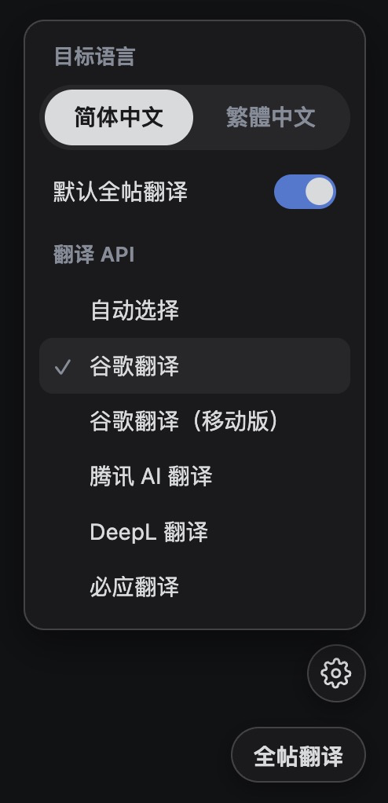

# Reddit-CN-Translator

一个用于 Tampermonkey / Violentmonkey 等脚本管理器的油猴用户脚本，仿照 YouTube 评论区「翻译」的交互方式，为新版 Reddit（`www.reddit.com`）帖子标题、正文与评论添加按需翻译功能。

脚本专门针对 Reddit 页面结构适配：可以只翻译自己想看的标题、正文或评论；再次点击可还原原文；也支持全帖批量翻译、简体/繁体中文目标语言切换，以及多个非官方翻译接口。

## 效果预览

按需翻译评论：

设置目标语言、默认全帖翻译和翻译 API：

## 功能特性

- 仿照 YouTube 评论翻译样式，在帖子标题、正文和评论旁显示「翻译成中文」按钮。
- 支持按需翻译，只翻译自己想看的内容。
- 再次点击可在译文和原文之间切换。
- 专门针对新版 Reddit 的帖子、评论和动态加载内容进行适配。
- 支持「全帖翻译」，可一次翻译当前帖子中的可翻译内容。
- 已包含中文的内容不会显示翻译按钮。
- 跳过代码块，避免破坏代码内容。
- 支持简体中文和繁體中文。
- 支持自动选择翻译 API，也可手动选择 Google、Google Mobile、腾讯 AI、DeepL、Bing 等接口。
- 可开启「默认全帖翻译」，进入帖子页后自动批量翻译。

## 安装

1. 安装一个油猴脚本管理器：
   - [Tampermonkey](https://www.tampermonkey.net/)
   - [Violentmonkey](https://violentmonkey.github.io/)
2. 打开脚本安装地址：
   - [Greasy Fork 安装页](https://greasyfork.org/zh-CN/scripts/578597-reddit-%E4%B8%AD%E6%96%87%E7%BF%BB%E8%AF%91)
   - [安装 RedditCNTranslator.user.js](https://raw.githubusercontent.com/dason-zou/Reddit-CN-Translator/main/RedditCNTranslator.user.js)
3. 在脚本管理器中确认安装。
4. 打开新版 Reddit：`https://www.reddit.com/`

## 使用方法

- 在帖子列表、帖子详情页或评论区中，点击内容旁的「翻译成中文」按钮进行单条翻译。
- 在帖子详情页右侧点击「全帖翻译」，批量翻译当前帖子标题、正文和评论。
- 点击「显示原文」可切回原文。
- 点击页面右侧的设置按钮，可切换目标语言、默认全帖翻译和翻译 API。

## 支持范围

- 支持：新版 Reddit `www.reddit.com`
- 不支持：`old.reddit.com`

## 隐私说明

本脚本会把需要翻译的文本发送到你选择的翻译服务。不同翻译服务的可用性、限流策略和隐私政策可能不同，请根据需要选择合适的翻译 API。

脚本不需要登录信息，也不会主动收集 Reddit 账号、Cookie 或 Token。

## 注意事项

- 翻译接口均为非官方接口，可能因为服务变更、限流或网络环境而失效。
- Reddit 页面结构变化可能导致按钮显示或翻译功能异常。
- 如果遇到问题，欢迎在 [Issues](https://github.com/dason-zou/Reddit-CN-Translator/issues) 反馈。

## 开发

这是一个油猴用户脚本项目，主要文件：

- `RedditCNTranslator.user.js`：用户脚本源码

本地修改后，可在用户脚本管理器中创建脚本并粘贴源码进行测试。

## License

MIT
